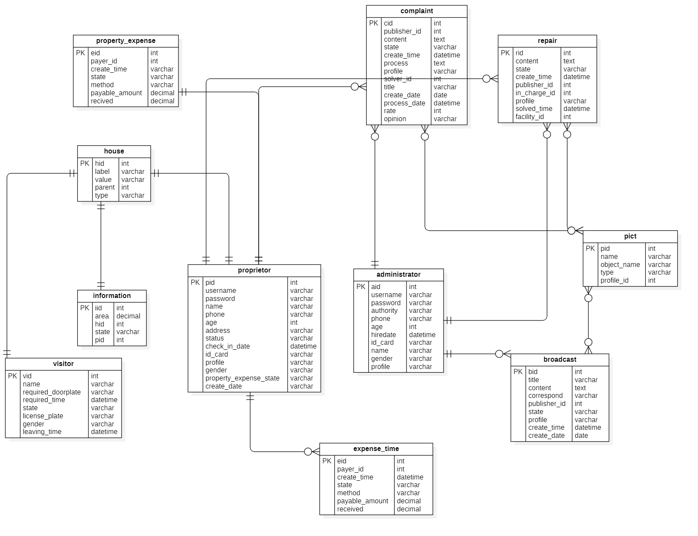
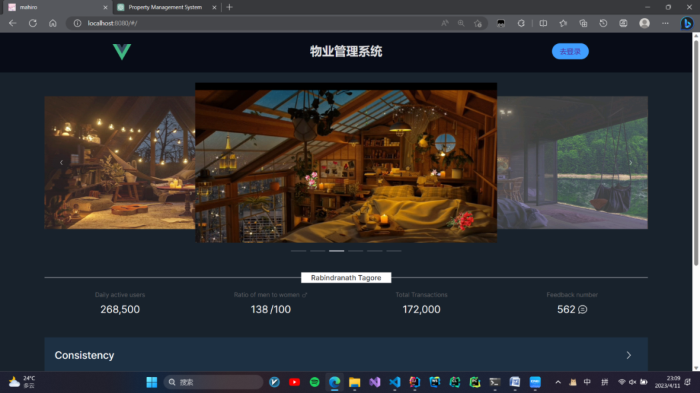
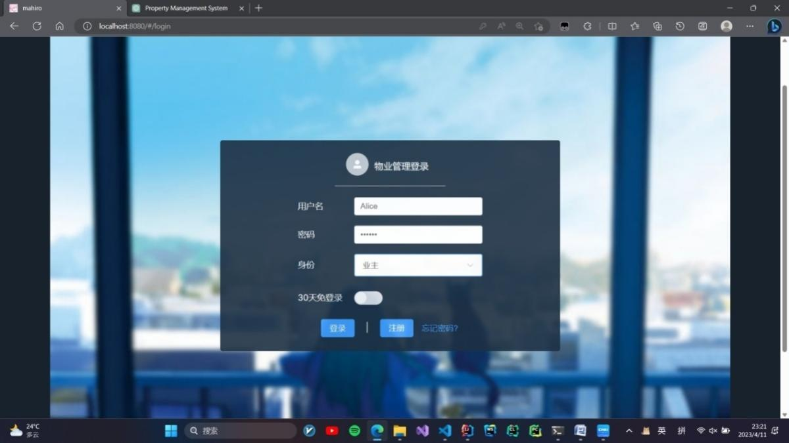
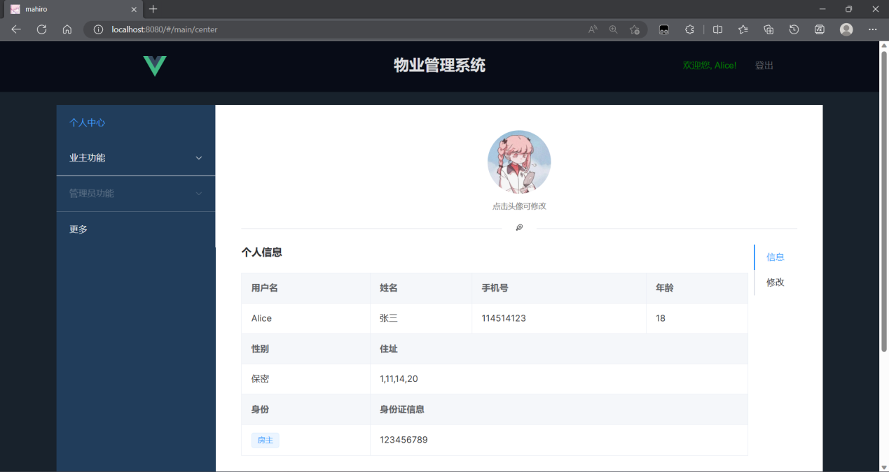
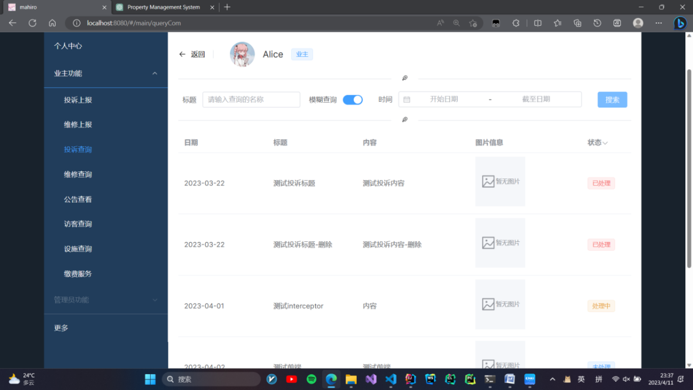
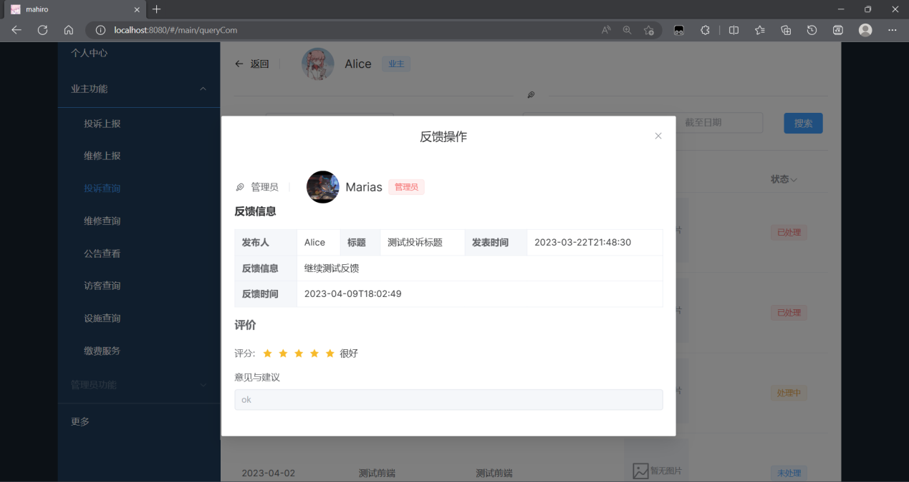

# pms 物业管理系统
## 系统描述
本项目为本人的毕业设计。首先通过需求分析拟定角色各自的功能需求，然后通过需求绘制出系统用例图，编写用例规约。
在项目中包括了投诉管理、公告管理、人员管理和缴费管理等小区物业基础服务。
旨在帮助物业管理员与小区业主提供便捷的网上服务。
项目采用了前后端分离的架构，后端采用了SpringBoot、SpringCloud技术栈开发，数据库使用了MySQL，Redis。
使用的中间件包括xxl-job用于任务调度，MinIO用于文件管理。同时使用了Nginx进行服务器端的反向代理。
主要的微服务分为综合表单微服务，人员管理微服务、缴费系统微服务、网关微服务等。
而前端采用了Vue+TypeScript+Vite的模式进行开发，同时使用了ElementUI进行页面的开发。
最后通过黑盒测试来检测系统的功能是否健全。

## 涉及技术
### 前端
- Vue
- ElementUI
- axios
### 后端
- SpringBoot
- SpringCloud
- MyBatisPlus
- MySQL
- Redis
- MinIO
- Xxl-job
- Nginx
- JWT
### 代码管理
- git

## 职责描述：
1. 负责数据库的设计；
2. 负责系统用例图、动态建模、静态建模的绘制；
3. 负责了后端代码的编写；
4. 负责了前端代码的编写；
5. 负责写用例测试, 编写swagger接口档案；
6. 负责前后端的测试，联调；
7. 使用postman进行接口测试，使用jmeter进行压力测试

---
## 数据库E-R图


---
### 职责描述：
1. 负责数据库的设计；
2. 负责系统用例图、动态建模、静态建模的绘制；
3. 负责了后端代码的编写；
4. 负责了前端代码的编写；
5. 负责写用例测试, 编写swagger接口档案；
6. 负责前后端的测试，联调；
7. 使用postman进行接口测试，使用jmeter进行压力测试
---
### 资源权限识别
- 通过反射与注解对任意实体类或是单个成员变量进行权限的鉴别
```java
@Documented
@Retention(RetentionPolicy.RUNTIME)
@Target({ElementType.FIELD, ElementType.TYPE})
public @interface Auth {
    //表明该字段或者类的访问权限
    String auth();
    //表明对类访问时排除指定的字段
    String[] exclude() default {};
}
```
```java
/**
 * 在dto上添加注释, 判断字段的访问权限, 返回字段被筛选后的类
 * 在类上添加注释, 表明该类的访问权限
 * @param <T> 鉴权dto类
 * @author GLaDOS
 */
@Component
public class HasAuth <T> {

    /**
     * 用户权限
     */
    private String userAuth;

    /**
     * dto实体
     */
    private T entity;

    /**
     * dto类
     */
    private Class<T> clazz;

    public HasAuth() {}

    public HasAuth(String userAuth, T entity, Class<T> clazz) {
        this.userAuth = userAuth;
        this.entity = entity;
        this.clazz = clazz;
    }

    public T afterAuth(){
        return this.afterAuth(userAuth, entity, clazz);
    }

    public T afterAuth(String userAuth, T entity, Class<T> clazz){
        try{
            T instance = clazz.getDeclaredConstructor().newInstance();
            String superAuth = null;
            String[] exclude = {};
            Auth superAnnotation;
            if ((superAnnotation = entity.getClass().getAnnotation(Auth.class)) != null){
                //如在类上声明
                superAuth = superAnnotation.auth();
                exclude = superAnnotation.exclude();
            }
            for (Field df : entity.getClass().getDeclaredFields()) {
                df.setAccessible(true);
                Auth annotation = df.getAnnotation(Auth.class);
                Field newDf = instance.getClass().getDeclaredField(df.getName());
                newDf.setAccessible(true);
                if (annotation == null) newDf.set(instance, df.get(entity));
                else if (userAuth.contains(annotation.auth()) ||
                        superAuth != null && userAuth.contains(superAuth) &&
                                !isContains(df.getName(), exclude))
                    newDf.set(instance, df.get(entity));
            }
            return instance;
        }catch (Exception e){
            e.printStackTrace();
            throw new PMSException("字段权限读取错误", Error.UNKNOWN_FAILED);
        }
    }

    private boolean isContains(String s, String[] arr) {
        return Arrays.asList(arr).contains(s);
    }
}
```
- 封装minio文件上传
```java
/**
 * 上传文件工具类
 * @author GLaDOS
 * @date 2023/4/1 18:22
 */
@Slf4j
@Component
public class UploadFiles {

    /**
     * 根据拓展名获取mimeType
     * @param ex 文件后缀
     * @return 文件类型
     */
    private static String getMimeType(String ex){
        if (ex == null) ex = "";
        ContentInfo extensionMatch = ContentInfoUtil.findExtensionMatch(ex);
        if (extensionMatch != null)
            return extensionMatch.getMimeType();
        //为空则返回通用类型 字节流
        return MediaType.APPLICATION_OCTET_STREAM_VALUE;
    }

    /**
     * 获取文件的md5
     * @param file 文件
     * @return md5
     */
    private static String getFileMd5(File file){
        try {
            FileInputStream fis = new FileInputStream(file);
            return DigestUtil.md5Hex(fis);
        } catch (FileNotFoundException e) {
            e.printStackTrace();
            log.error("文件名转换为md5失败-------->"+e.getMessage());
            return null;
        }
    }

    /**
     * 文件上传至minio
     * @param filename 文件名
     * @param localFilePath 本地路径
     * @param bucket 桶
     * @param minioClient minio类
     * @return objectName
     */
    public String uploadFile2Minio(String filename, String localFilePath, String bucket, MinioClient minioClient){
        //获取后缀
        String ex = filename.substring(filename.lastIndexOf("."));
        //得到mimeType
        String mimeType = UploadFiles.getMimeType(ex);
        //获取文件的md5
        String fileMd5 = UploadFiles.getFileMd5(new File(localFilePath));
        //文件在minio中保存的地址
        String objectName = DateUtil.format(new Date(), "yyyy/MM/dd") + "/" + fileMd5 + ex;

        //将文件上传至minio
        try{
            minioClient.uploadObject(
                    UploadObjectArgs.builder()
                            .bucket(bucket)
                            .object(objectName)
                            .filename(localFilePath)
                            .contentType(mimeType)
                            .build()
            );
            return objectName;
        }catch (Exception e){
            e.printStackTrace();
            throw new PMSException("上传失败!", Error.UPLOAD_FILE_FAILED);
        }
    }

    /**
     * 上传用户头像
     * @param filename 文件名
     * @param localFilePath 文件地址
     * @param mapper 用户对应的mapper对象
     * @param bucket 桶
     * @param instance 从数据库获取的用户类实例
     * @param <T> mapper
     * @param <K> 用户类
     * @return RR
     */
    public <T extends BaseMapper<K>, K> RestResponse<?> uploadFile(String filename,
                                                                   String localFilePath,
                                                                   T mapper,
                                                                   String bucket,
                                                                   K instance,
                                                                   MinioClient minioClient){
        if (instance == null)
            return RestResponse.validFail("没有对象!", Error.UNAUTHORIZED);
        UploadFiles uploadFiles = new UploadFiles();

        try {
            Field profile = instance.getClass().getDeclaredField("profile");
            profile.setAccessible(true);
            //先判断用户是否已经有头像
            String path;
            if ((path = (String) profile.get(instance)) != null){
                //先删除用户当前头像
                minioClient.removeObject(
                        RemoveObjectArgs.builder()
                                .bucket(bucket)
                                .object(path)
                                .build()
                );
            }

            //上传头像
            String objectName = uploadFiles.uploadFile2Minio(filename, localFilePath, bucket, minioClient);

            //将文件路径上传至db
            profile.set(instance, objectName);
            if (mapper.updateById(instance) == 1)
                return RestResponse.success("success", objectName, Valid.UPLOAD_FILE_SUCCESS);
            return RestResponse.validFail("上传失败!", Error.UPLOAD_FILE_FAILED);
        }catch (Exception e){
            e.printStackTrace();
            throw new PMSException("上传失败!", Error.UPLOAD_FILE_FAILED);
        }
    }
}
```
- 将表中的profile及保存图片信息id的表转换为图片的实际地址
```java
/**
 * @author GLaDOS
 * @date 2023/4/5 18:05
 */
public class General {

    /**
     * 将表中的profile及保存图片信息id的表转换为图片的实际地址
     * @param dClazz dto.class
     * @param listDto Array(dto)
     * @param <O> po
     * @param <D> dto
     */
    public <O, D> void fillPictInfo(Class<? extends D> dClazz,
                                       List<D> listDto, Page<O> page,
                                       PictMapper pictMapper){
        try{
            //遍历获取的分页信息
            for (O record : page.getRecords()) {
                //实例化一个dto
                D result = dClazz.getDeclaredConstructor().newInstance();
                //获取result的objectName变量
                Field objectName = result.getClass().getDeclaredField("objectName");
                objectName.setAccessible(true);
                //将单个分页信息拷贝到dto中
                BeanUtil.copyProperties(record, result);
                //获取单个分页信息的profile变量与id变量
                Field profile = record.getClass().getDeclaredField("profile");
                Field id = Arrays.stream(record.getClass().getDeclaredFields()).filter(field -> field.getName().contains("id")).findFirst().orElse(null);
                if (id != null)
                    id.setAccessible(true);
                profile.setAccessible(true);
                String profiles = (String) profile.get(record);
                if (profiles != null){
                    ArrayList<String> names = new ArrayList<>();
                    for (String s : profiles.split(",")) {
                        //获取对应的pict信息
                        Pict pict = pictMapper.selectById(s);
                        //将图片信息写入结果
                        names.add(pict.getObjectName());
                        //设置图片信息对应的ProfileId
                        if (pict.getProfileId() == null && id != null){
                            pict.setProfileId((Integer) id.get(record));
                        }
                        pictMapper.updateById(pict);
                    }
                    objectName.set(result, names);
                }
                listDto.add(result);
            }
        }catch (Exception e){
            e.printStackTrace();
            throw new PMSException("无法获取pict对应信息");
        }
    }
}
```
- 查询树形结构的楼栋信息表
**SQL语句**
```mysql
with recursive t1 as (
    select p.* from house p where p.hid = #{id}
    union all
    select p1.* from house p1 inner join t1 on t1.hid = p1.parent
)
select * from t1 order by t1.parent
```
**Java语句**
```java
/**
 * <p>
 *  服务实现类
 * </p>
 *
 * @author GLaDOS
 */
@Slf4j
@Service
public class HouseServiceImpl extends ServiceImpl<HouseMapper, House> implements HouseService {

    @Autowired
    private HouseMapper houseMapper;

    @Override
    public RestResponse<ResultHouseDto> getBuildingInfoById(Integer id, String type) {
        Integer parent = 0;
        Map<Integer, List<ResultHouseDto>> houseDtoHashMap = new LinkedHashMap<>();
        ArrayList<ResultHouseDto> resultHouseDto = new ArrayList<>();
        List<House> houseInfoByOrder = houseMapper.getHouseInfoByOrder(id);

        if (houseInfoByOrder == null)
            return RestResponse.validFail("没有对象", Error.DATABASE_SELECT_FAILED);
        try {
            for (House house : houseInfoByOrder) {
                //遍历全部对象
                if (!house.getParent().equals(parent)) {
                    //当单个对象的父节点不等于parent时将resultHouseDto保存在map中并新引用一个resultHouseDto
                    houseDtoHashMap.put(parent, resultHouseDto);
                    resultHouseDto = new ArrayList<>();
                    parent = house.getParent();
                }
                ResultHouseDto temp = new ResultHouseDto();
                BeanUtil.copyProperties(house, temp);
                temp.setToDisLabel(temp.getValue() + temp.getLabel());
                resultHouseDto.add(temp);
            }
            if (resultHouseDto.size() > 0)
                houseDtoHashMap.put(parent, resultHouseDto);

            List<Integer> collect = new ArrayList<>(houseDtoHashMap.keySet());
            Collections.reverse(collect);

            //类似冒泡排序
            for (int i = 0; i < collect.size(); i++) {
                for (int j = i + 1; j < collect.size(); j++) {
                    for (ResultHouseDto houseDto : houseDtoHashMap.get(collect.get(j))) {
                        if (collect.get(i).equals(houseDto.getHid())) {
                            houseDto.setChildren(houseDtoHashMap.get(collect.get(i)));
                            break;
                        }
                    }
                }
            }

            ResultHouseDto finalResult = houseDtoHashMap.get(0).get(0);
            finalResult.setLastId(houseMapper.getHouseLastId());
            return RestResponse.success(finalResult, "查询成功", Valid.DATABASE_SELECT_SUCCESS);
        } catch (Exception e) {
            e.printStackTrace();
            throw new PMSException("获取楼栋信息失败", Error.DATABASE_SELECT_FAILED);
        }
    }
}
```
---
## 系统页面展示
### 主页面

### 登录页面

### 个人中心

### 投诉页面

### 投诉反馈
